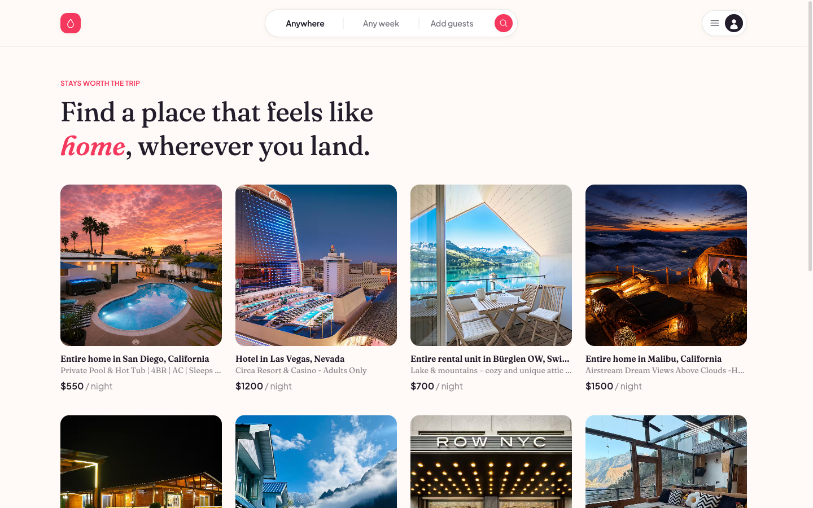

# Airbnc

A full-stack Airbnb-style booking platform — browse listings, sign up and host your own place, upload photos, and book stays with real-time availability pricing. Built as a MERN application with cookie-based JWT auth, Cloudinary-backed media storage, and a from-scratch GSAP-animated UI.

**Live app:** [airbnc-puce.vercel.app](https://airbnc-puce.vercel.app)
**Live API:** [airbnc-api.onrender.com](https://airbnc-api.onrender.com)



> Note: the API runs on Render's free tier, which spins down after 15 minutes of inactivity. The first request after idle time can take 20–50 seconds to wake up — that's expected, not a bug.

---

## Table of Contents

- [Features](#features)
- [Tech Stack](#tech-stack)
- [Architecture](#architecture)
  - [How authentication works](#how-authentication-works)
  - [How photo uploads work](#how-photo-uploads-work)
  - [Deployment topology](#deployment-topology)
- [Project Structure](#project-structure)
- [Getting Started](#getting-started)
- [API Reference](#api-reference)
- [Security Notes](#security-notes)
- [Known Limitations](#known-limitations)

---

## Features

**For guests**
- Browse all listed places on a searchable homepage grid
- View a listing's full photo gallery, description, perks, and location (linked to Google Maps)
- Book a place for a date range, with live nightly-rate × night-count pricing
- View booking history and confirmation details

**For hosts**
- Register / log in with hashed passwords (bcrypt) and JWT session cookies
- Create, edit, and delete your own listings — title, address, description, perks, check-in/out times, max guests, price
- Upload multiple photos at once (drag-select), or add a photo by pasting a URL — both are stored permanently in Cloudinary, not on the server's disk
- Manage your accommodations from a dedicated dashboard with inline edit/delete controls
- Ownership is enforced server-side: you can only edit or delete listings (and their photos) that you actually own

**Platform**
- Fully responsive, redesigned UI with a custom design system (Fraunces + Plus Jakarta Sans, coral/ink palette)
- GSAP-powered interactions: staggered grid reveals, sliding tab indicators, photo-gallery transitions, scroll-aware header
- Graceful failure states throughout — slow/broken network calls show a retry message instead of an infinite spinner or a silent blank screen
- Deleting a listing doesn't orphan a guest's booking history — past bookings still show their dates and price even if the listing is later removed

## Tech Stack

| Layer | Technology |
|---|---|
| **Frontend** | React 19, Vite 6, React Router 7, Tailwind CSS v4, Axios, GSAP, date-fns |
| **Backend** | Node.js, Express 4 |
| **Database** | MongoDB Atlas via Mongoose — `User`, `Place`, `Booking` collections |
| **Auth** | JWT (`jsonwebtoken`) in an `httpOnly` cookie, `bcryptjs` password hashing |
| **Media storage** | Cloudinary (direct upload + fetch-by-URL), `multer` for multipart parsing |
| **Deployment** | Vercel (client, SPA rewrites via `vercel.json`), Render (API, `render.yaml` blueprint), MongoDB Atlas, Cloudinary |

## Architecture

Airbnc is a monorepo with two independently deployed apps that only talk to each other over HTTPS — there's no shared server, session store, or filesystem between them.

```
Client — React SPA (Vercel)
   │
   │  HTTPS + JSON, httpOnly auth cookie
   ▼
API — Express server (Render)
   │
   ├── MongoDB Atlas    (users, places, bookings)
   └── Cloudinary       (listing photos)
```

### How authentication works

1. `POST /register` hashes the password with bcrypt before storing the user.
2. `POST /login` verifies the password, signs a JWT (`{ id, email }`, 7-day expiry), and sets it as an `httpOnly` cookie — the token is never exposed to client-side JavaScript.
3. Every protected route (`/places` writes, `/bookings`, `/upload`, etc.) verifies that cookie server-side with `jwt.verify` before touching the database, and re-checks resource ownership (e.g. `placeDoc.owner === decoded.id`) before allowing an edit or delete.
4. Because the client (`*.vercel.app`) and API (`*.onrender.com`) are on different domains, the cookie is issued with `SameSite=None; Secure` in production — required for cross-site cookies to be sent at all — while falling back to `SameSite=Lax` for local development over plain `http://localhost`.

### How photo uploads work

Uploaded photos never touch the API server's own disk. Render's filesystem is ephemeral — anything written to it is wiped on every redeploy or idle-timeout restart — so photos are streamed straight to Cloudinary instead:

- **File upload:** `multer` parses the multipart request into memory, each file is base64-encoded and handed to `cloudinary.uploader.upload()`, and the returned CDN URL is what actually gets stored on the `Place` document.
- **Upload by link:** the pasted URL is passed directly to Cloudinary, which fetches and re-hosts it.
- **Delete:** removing a photo (or an entire listing) also issues a `cloudinary.uploader.destroy()` call, so storage doesn't silently accumulate orphaned images.

### Deployment topology

| Piece | Host | Notes |
|---|---|---|
| Client | Vercel | Static Vite build; `vercel.json` rewrites all paths to `index.html` so React Router's client-side routes don't 404 on direct navigation/refresh |
| API | Render | Deployed via the `render.yaml` blueprint; auto-redeploys on push to `main` |
| Database | MongoDB Atlas | Free M0 cluster |
| Media | Cloudinary | Free tier |

## Project Structure

```
Airbnc/
├── client/                  React + Vite frontend
│   ├── src/
│   │   ├── pages/            Route-level views (Index, Login, PlacePage, PlacesPage, ...)
│   │   ├── lib/animations.js  Shared GSAP hooks (stagger reveal, entrance reveal)
│   │   ├── config.js          API_URL / photoUrl helpers (env-driven, not hardcoded)
│   │   └── UserContext.jsx    Auth state provider
│   └── vercel.json            SPA rewrite rule
├── api/                     Express backend
│   ├── collections/           Mongoose models — User, Place, Booking
│   ├── index.js                All routes: auth, places, bookings, uploads
└── render.yaml                Render deployment blueprint
```

## Getting Started

### Prerequisites

- Node.js 18+ (Node 22+ will crash on `jsonwebtoken`'s dependency chain — see [Known Limitations](#known-limitations))
- A MongoDB connection string (local `mongod` or a free [Atlas](https://www.mongodb.com/cloud/atlas) cluster)
- A free [Cloudinary](https://cloudinary.com) account (for photo uploads)

### 1. Clone and install

```bash
git clone https://github.com/monishpatalay/Airbnc.git
cd Airbnc
cd api && npm install
cd ../client && npm install
```

### 2. Configure environment variables

```bash
cp api/.env.example api/.env
cp client/.env.example client/.env
```

Fill in `api/.env`:

```env
MONGODB_URI=your_mongodb_connection_string
JWT_SECRET=any_random_string
CLOUDINARY_CLOUD_NAME=your_cloud_name
CLOUDINARY_API_KEY=your_api_key
CLOUDINARY_API_SECRET=your_api_secret
```

`client/.env` just needs to point at your local API:

```env
VITE_API_URL=http://localhost:3000
```

### 3. Run it

```bash
# Terminal 1
cd api && npm run dev

# Terminal 2
cd client && npm run dev
```

Open the URL Vite prints (typically `http://localhost:5173`).

## API Reference

| Method | Route | Auth required | Purpose |
|---|---|:---:|---|
| POST | `/register` | – | Create an account |
| POST | `/login` | – | Authenticate, sets JWT cookie |
| POST | `/logout` | – | Clears the auth cookie |
| GET | `/profile` | ✓ | Current logged-in user |
| GET | `/places` | – | All listings (public homepage) |
| GET | `/places/:id` | – | Single listing detail |
| POST | `/places` | ✓ | Create a listing |
| PUT | `/places` | ✓ (owner) | Update a listing |
| DELETE | `/places/:id` | ✓ (owner) | Delete a listing + its Cloudinary photos |
| GET | `/user-places` | ✓ | Listings owned by the current user |
| POST | `/upload` | ✓ | Upload photo files (multipart, → Cloudinary) |
| POST | `/upload-by-link` | ✓ | Fetch a photo by URL (→ Cloudinary) |
| DELETE | `/remove-photo` | ✓ (owner) | Delete a single photo |
| POST | `/bookings` | ✓ | Create a booking |
| GET | `/bookings` | ✓ | Current user's bookings |
| GET | `/bookings/:id` | – | Single booking detail |

## Security Notes

- Passwords are hashed with `bcryptjs`; the plaintext password is never stored or logged.
- Auth tokens live in an `httpOnly` cookie — inaccessible to JavaScript, mitigating XSS-based session theft.
- Every mutating route re-verifies the JWT server-side and checks resource ownership before acting — a user cannot edit, delete, or remove photos from another user's listing even if they guess/enumerate its ID.
- Upload and delete-photo routes validate the requester's identity, reject path-traversal attempts in filenames, and cap file size/type on uploads.
- `.env` files (real credentials) are gitignored; only `.env.example` templates are committed.

> **Historical note:** an early commit in this repository's history briefly included real database and JWT credentials before `.env` was gitignored. Those specific credentials have since been rotated and the services they pointed to are no longer in use — but if you fork this repo, be aware the old values are still visible in git history and should not be reused.

## Known Limitations

- **Render free-tier cold starts.** The API sleeps after 15 minutes of inactivity; the first request afterward can take up to ~50 seconds.
- **Node.js version constraint.** `jsonwebtoken`'s dependency chain (`jwa` → `buffer-equal-constant-time`) relies on `Buffer.SlowBuffer`, which newer Node.js versions have removed entirely — the API must run on Node ≤ 22 until that transitive dependency is updated upstream.
- **No cascading delete for bookings.** Deleting a listing does not delete existing bookings for it — this is intentional (a guest's booking history and receipt shouldn't vanish because a host removed the listing), but it means a booking can reference a place that no longer exists; the UI handles this by showing "Listing no longer available" instead of crashing.
